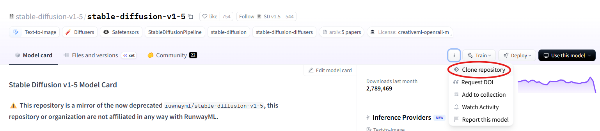
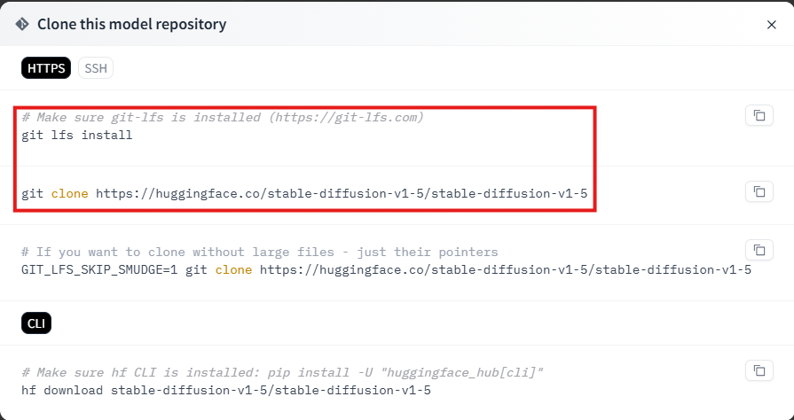
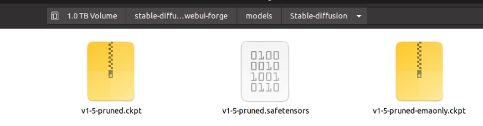
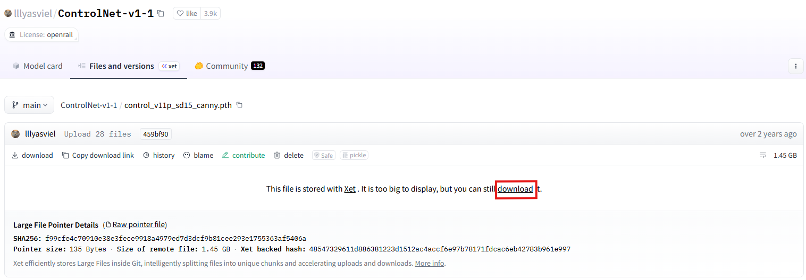
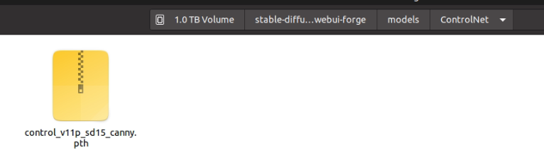

# SFG

本專案示範如何從人像圖片產生相對應的文字描述，再利用 Stable Diffusion 與 ControlNet 根據描述重新生成圖片。流程分為三個主要步驟：

1. 透過 `prompt_generate.py` 使用 GPT 產生人像特徵描述（Markdown 格式）。
2. 使用 `beforeSD.py` 將特徵描述整理成純文字提示語。
3. 使用 `image_generate.py` 搭配 Stable Diffusion 依提示語重新生成圖片，並輸出 Canny Edge 與結果圖片。

## 使用 Stable Diffusion

請參考 [stable-diffusion-webui-forge](https://github.com/lllyasviel/stable-diffusion-webui-forge)

1. 複製repository到本地
   ```bash
   git clone https://github.com/lllyasviel/stable-diffusion-webui-forge.git
   ```   
2. 建立虛擬環境並安裝相依套件
   ```bash
   cd stable-diffusion-webui-forge
   conda create -n sd python=3.10
   conda activate sd
   pip install -r requirements_versions.txt
   ```
3. 啟動 Web UI
   ```bash
   python launch.py --api
   ```
4. 下載 Stable Diffusion 模型權重並放置於 `models/Stable-diffusion/` 資料夾中。
   [下載連結](https://huggingface.co/stable-diffusion-v1-5/stable-diffusion-v1-5)
   
   
   
5. 下載 ControlNet 模型權重並放置於 `models/ControlNet/` 資料夾中。
   [下載連結](https://huggingface.co/lllyasviel/ControlNet-v1-1/blob/main/control_v11p_sd15_canny.pth)
   
   
6. 在 `SFG/cfg.py` 內設定你的 OpenAI API Key：
   ```python
   def api_key():
       key = "sk-XXXX"
       return key
   ```

## 專案結構

```
SFG/
├─ female_sample/   # 放置輸入圖片
├─ female_prompt/   # 儲存 GPT 回傳的 Markdown 描述
├─ test/            # 儲存整理後的 txt 提示語
├─ female_gen/      # 儲存 Stable Diffusion 生成的圖片
├─ canny_edges/     # 儲存 Canny Edge 影像
├─ prompt_generate.py
├─ beforeSD.py
├─ image_generate.py
├─ clean.py         # 選擇性：資料集抽樣
└─ cfg.py
```

## 使用流程

### 1. 準備圖片資料
將待處理的人像圖片放入 `female_sample/`（或依需求調整程式中的路徑）。

### 2. 產生人像特徵描述
執行以下程式讓 GPT 分析每張圖片並輸出 Markdown：
```bash
python prompt_generate.py
```
- 輸出：`female_prompt/` 內會產生對應的 `.md` 描述文件。

### 3. 轉換描述為 Stable Diffusion 提示語
```bash
python beforeSD.py
```
- 輸出：`test/` 內會得到每張圖片對應的 `.txt` 提示語。

### 4. 根據提示語重新生成圖片
```bash
python image_generate.py
```
- 程式會：
  - 為每張輸入圖片產生 Canny Edge（儲存於 `canny_edges/`）。
  - 呼叫 Stable Diffusion API 生成新圖片（儲存於 `female_gen/`）。

### 5. （選擇性）整理資料集
若需要從大量資料中抽樣，可使用：
```bash
python clean.py
```
此腳本會從指定資料夾每隔一張取一張圖片到 `male_sample/` 或 `female_sample/` 等輸出資料夾。

## 使用後可獲得的成果

- `female_prompt/`：每張圖片的 Markdown 特徵描述。
- `test/`：可直接用於 Stable Diffusion 的文字提示語。
- `canny_edges/`：輸入圖片的 Canny Edge 圖片。
- `female_gen/`：根據提示語生成的新圖片。

透過以上流程，您可以從原始的人像資料中，經由 GPT 生成文字描述，再利用 Stable Diffusion + ControlNet 重新創作新圖像。
